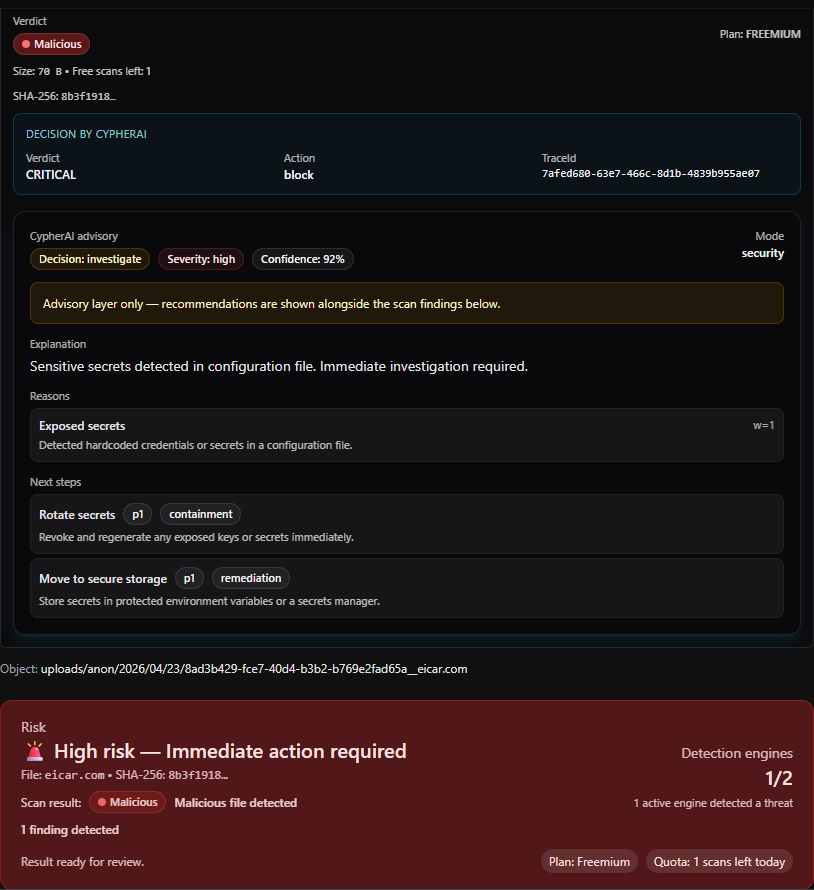

# CypherScan Strapi Plugin

Scan uploaded files for malware, exposed secrets, and payloads that often pass basic checks but break later in production.

> Early validation from real usage, logged scans, and developer feedback.

## Example result

## Early signals

- 120+ downloads within the first day
- Real scans logged outside local testing
- Early positive feedback captured from actual usage
- Developer feedback from Reddit and Indie Hackers
- Built around recurring cases where files look valid on upload but break later

## What it does

Hooks into the Strapi upload lifecycle and scans files right after upload, before they are used anywhere else.

It returns:

- verdict (clean / suspicious / malicious)
- risk level
- score
- traceId

## Demo

https://youtu.be/zRk-9Es7mwA

## Installation

Install the plugin:

npm install cypherscan-strapi

Then configure your environment variables:

CYPHERSCAN_API_KEY=cs_xxxxx  
CYPHERSCAN_BASE_URL=https://cyphernetsecurity.com

Restart your Strapi app.

## Flow

Upload → Scan → Verdict

## Why

Most basic checks (size, mime-type) pass, but issues often appear later when files are actually processed.

By default, upload flows trust files too early.

This plugin adds a scan step directly in the upload lifecycle to ensure files are validated before being used in your system.

## Status

Validated in an external Strapi app. Marketplace submission in progress.